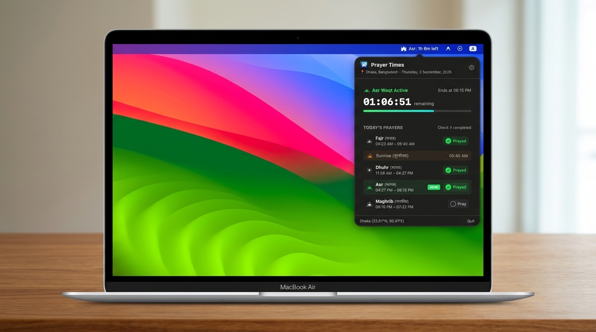

# Prayer Times for macOS 🕌

[](https://apple.com)
[-orange?style=flat-square)](https://apple.com)
[](https://swift.org)
[](LICENSE)

An ultra-lightweight, native macOS menu bar application designed for Islamic prayer times in Dhaka, Bangladesh (and worldwide via GPS auto-detection). It lives quietly in your menu bar next to your Wi-Fi and Battery indicators, providing real-time waqt countdowns, daily prayer checklists, and an automated Kaza (missed prayer) tracker.

---

<p align="center">
  
</p>

---

## ✨ Features

- **Top Menu Bar Indicator**: Minimalist, native vector monochrome mosque glyph in your macOS menu bar alongside Wi-Fi and Battery (`isTemplate = true`).
- **Live Waqt Countdown**: Displays the active prayer and remaining time (e.g., `🕌 Asr: 1h 6m left`) at a glance.
- **Accurate Astronomical Calculation**: Calibrated with Islamic Foundation Bangladesh / Karachi standards (18° Fajr & Isha). Supports both **Hanafi** and **Shafi'i** Asr methods.
- **CoreLocation GPS Auto-Detection**: Automatically detects your latitude, longitude, city name, and system timezone with offline fallback to Dhaka.
- **Daily Prayer Checklists**: Click on any prayer (Fajr, Dhuhr, Asr, Maghrib, Isha) to check it off with satisfying visual checkmarks.
- **Automated Kaza (Missed Prayer) Tracker**:
  - Automatically flags a prayer as **missed** if its waqt ends without being marked as prayed.
  - Increments your Kaza tally and sends a native macOS reminder notification.
  - Interactive `[ - ]` and `[ + ]` controls allow you to track and clear your Kaza backlog.
- **In-App Launch at Startup**: Toggle **"Launch at Mac Startup"** directly inside the Preferences panel with one click (powered by `SMAppService`).
- **Universal 2 Binary**: Runs natively on both Apple Silicon (M1/M2/M3/M4) and Intel Macs with zero emulation overhead.
- **100% Offline & Private**: Consumes less than 25MB RAM and near-zero CPU. All astronomical math runs on-device with zero tracking or telemetry.

---

## 📥 Download & Installation

### Option 1: Direct Download (Pre-compiled)
Download the latest pre-compiled Universal 2 release:
- **Download**: [`PrayerTimes-macOS-Universal.zip`](https://zebaafiashama.xyz/wp-content/uploads/2026/09/PrayerTimes-macOS-Universal.zip)

1. Unzip the downloaded file.
2. Drag `PrayerTimes.app` into your `/Applications` folder.
3. **First-time install:** Right-click (or Control-click) `PrayerTimes.app` and select **Open**, then click **Open** on the dialog.

---

### Option 2: Build from Source

Requirements: macOS 13+ with Xcode Command Line Tools installed (`xcode-select --install`).

```bash
# Clone the repository
git clone https://github.com/ZebaAfiaShama/PrayerTimes-macOS.git
cd PrayerTimes-macOS

# Build Universal 2 application bundle
./build_app.sh

# Run the app
open PrayerTimes.app
```

---

## 🛠 Architecture & Tech Stack

- **Frameworks**: Swift 6, AppKit, SwiftUI, CoreLocation, UserNotifications, ServiceManagement.
- **Solar Math**: Standalone high-precision astronomical algorithms (Julian Day, solar mean anomaly, equation of time, solar declination, hour angles).
- **Target**: Universal 2 (`arm64` + `x86_64`) macOS 13.0+.

---

## 👤 Author

**Zeba Afia Shama**
- Website: [zebaafiashama.xyz](https://zebaafiashama.xyz)
- Portfolio Page: [zebaafiashama.xyz/app/prayer-time-app](https://zebaafiashama.xyz/app/prayer-time-app/)
- LinkedIn: [linkedin.com/in/zeba-afia-shama](https://www.linkedin.com/in/zeba-afia-shama/)

---

## 📄 License

This project is licensed under the MIT License - see the [LICENSE](LICENSE) file for details.
